<div align="center">

# Highly Available Web Application on AWS

#### Three-tier architecture provisioned end-to-end with Terraform

[](https://developer.hashicorp.com/terraform/cli)
[](https://registry.terraform.io/providers/hashicorp/aws/latest/docs)
[](https://aws.amazon.com/about-aws/global-infrastructure/regions_az/)
[]()
[]()
[]()
[](.github/workflows/terraform.yml)

</div>

A complete reference deployment of a three-tier web application on AWS, built with Terraform Infrastructure as Code. The stack survives the loss of a whole Availability Zone, scales the compute tier on its own, and serves traffic globally through CloudFront with WAF in front. Every resource is declared in code; one `terraform apply` brings the whole thing up.

This repository is the **Phase 2 deliverable** and **Phase 3 Finalization** of the *Cloud Programming (DLBSEPCP01_E)* portfolio at the IU International University of Applied Sciences.

---

## Table of contents

1. [Architecture at a glance](#architecture-at-a-glance)
2. [What you get](#what-you-get)
3. [Tech stack](#tech-stack)
4. [Repository layout](#repository-layout)
5. [Prerequisites](#prerequisites)
6. [Quick start](#quick-start)
7. [Step-by-step deployment](#step-by-step-deployment)
8. [Module reference](#module-reference)
9. [Verifying the deployment](#verifying-the-deployment)
10. [Live application](#live-application)
11. [Tearing it down](#tearing-it-down)
12. [Troubleshooting](#troubleshooting)
13. [Author and course](#author-and-course)

---

## Architecture at a glance

<div align="center">
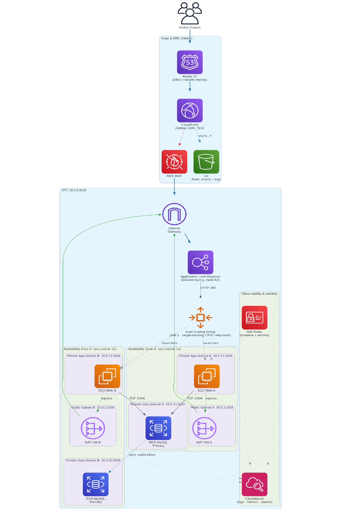

<sub><i>Figure 1 — Three-tier AWS architecture in eu-central-1, two Availability Zones. Source: Own representation.</i></sub>
</div>

| Tier | Service | What it does |
|---|---|---|
| **Edge** | CloudFront + AWS WAF + S3 (OAC) | TLS termination at the global edge, common-exploit filtering, private bucket for static assets reached only via CloudFront |
| **Compute** | Application Load Balancer + EC2 Auto Scaling Group | Spreads requests across two AZs; scales out on CPU **or** request-count; instances boot a small Apache page that prints the serving AZ |
| **Data** | Amazon RDS for MySQL (Multi-AZ) + KMS | Synchronous standby in the second AZ; customer-managed encryption key with annual rotation; seven-day backups |
| **Network** | Amazon VPC, six subnets, two NAT Gateways | Private subnets for compute and data; per-AZ NAT means a single NAT failure never blackholes the other zone |
| **Observability** | Amazon CloudWatch | Metrics, alarms, logs from every layer (standard) |

---

## What you get

- **High availability** — two AZs end to end (subnets, ALB, ASG, NAT, RDS Multi-AZ)
- **Global low latency** — CloudFront edge with TLS termination
- **Autoscaling** — two target-tracking policies (average CPU, ALB requests-per-target)
- **Security defaults** — IMDSv2 enforced, private subnets for EC2/RDS, per-tier security groups, WAFv2 with AWS-managed rule groups, KMS-encrypted RDS, S3 bucket reachable only via CloudFront OAC, least-privilege IAM
- **Replicability** — five single-responsibility Terraform modules, pinned providers, secrets in `terraform.tfvars` (gitignored)
- **One-command deploy** — `terraform apply` produces 52 resources in ~20 minutes

---

## Tech stack

| Layer | Technology | Notes |
|---|---|---|
| IaC | Terraform 1.6+ | Pinned in `providers.tf` |
| AWS provider | hashicorp/aws ~> 5.40 | + alias for `us-east-1` (CloudFront WAFv2) |
| Cloud | Amazon Web Services | Region: `eu-central-1` (CloudFront edge is global) |
| Web tier | Apache HTTP Server on Amazon Linux 2023 | Bootstrapped via cloud-init user-data |
| Database | MySQL 8.0 on RDS | `db.t3.micro`, Multi-AZ, KMS-encrypted |
| Version control | Git + GitHub | Public repository |

---

## Repository layout

```
CloudProgramming/
├── providers.tf              # Terraform + AWS provider pins
├── variables.tf              # Root inputs
├── main.tf                   # Wires the 5 modules together
├── outputs.tf                # ALB URL, CloudFront domain, RDS endpoint
├── terraform.tfvars.example  # Copy to terraform.tfvars and set db_password
├── README.md                 # This file
├── .gitignore                # Excludes state files and tfvars
├── docs/screenshots/         # Evidence captured during deployment
└── modules/
    ├── network/   # VPC, six subnets, IGW, two NAT GWs, route tables
    ├── alb/       # ALB, security group, target group, HTTP listener
    ├── asg/       # Launch template (IMDSv2), ASG, two scaling policies, IAM role
    ├── rds/       # DB subnet group, security group, MySQL Multi-AZ, KMS key
    └── cdn/       # CloudFront distribution, WAFv2 WebACL, S3 (OAC) bucket
```

Each module has the standard trio of `main.tf`, `variables.tf` and `outputs.tf` so it can be reviewed, versioned and reused on its own.

---

## Prerequisites

| Tool | Minimum version | Install link |
|---|---|---|
| Terraform | 1.6 | <https://developer.hashicorp.com/terraform/install> |
| AWS CLI | 2.x | <https://docs.aws.amazon.com/cli/latest/userguide/install-cliv2.html> |
| Git | any recent | <https://git-scm.com/downloads> |

You also need an AWS account with permissions to create VPC, EC2, ALB, RDS, CloudFront, WAF, S3, IAM and KMS resources. For a grading account, attaching the AWS-managed `AdministratorAccess` policy is the simplest path.

<details>
<summary><strong>Verify your local toolchain</strong></summary>

```bash
terraform -version
aws --version
git --version
```

<div align="center">
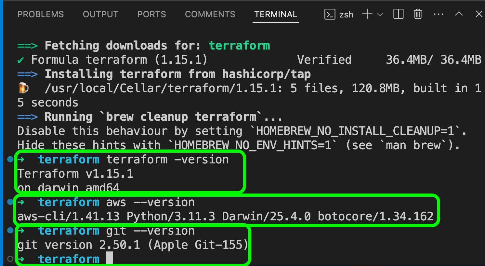

<sub><i>Figure 2 — Local toolchain verification. Source: Own representation.</i></sub>
</div>

</details>

---

## Quick start (one-command workflow)

```bash
# 1. Clone
git clone https://github.com/frankkode/CloudProgramming.git
cd CloudProgramming

# 2. Set the database password (file is gitignored)
cp terraform.tfvars.example terraform.tfvars
$EDITOR terraform.tfvars      # set db_password (>= 8 chars)

# 3. Configure AWS credentials
aws configure                 # region = eu-central-1

# 4. Deploy + smoke-test
make apply                    # ~15-20 minutes
make verify                   # confirms cross-AZ load balancing
```

When `make apply` finishes, the URLs print automatically. Open either in a browser and refresh — the page reports the Availability Zone of the instance that served the request.

To tear everything down (handles RDS deletion-protection automatically):

```bash
make destroy
```

### All make targets

```text
$ make help
  apply        Apply the most recent plan (~15-20 min)
  check        Format then validate — what CI runs locally
  ci-checks    What GitHub Actions runs on every push (no AWS access)
  clean        Remove generated state-cache and plan files (keeps tfstate!)
  destroy      Tear the entire stack down (handles RDS deletion protection)
  fmt          Format all Terraform files in place
  help         Show this help message
  init         Run terraform init (downloads providers + modules)
  outputs      Print public outputs (ALB URL, CloudFront URL)
  plan         Generate a plan and save it to plan.tfplan
  validate     Validate the configuration (no AWS calls)
  verify       Smoke-test the live deployment (cross-AZ load balancing)
```

### Continuous integration

Every push and pull request to `main` runs the GitHub Actions workflow at
[`.github/workflows/terraform.yml`](.github/workflows/terraform.yml):

* `terraform fmt -check -recursive` — fails the build on un-formatted code
* `terraform init -backend=false` — confirms providers and modules resolve
* `terraform validate` — runs against the root and against every module

No AWS credentials are required for CI — these are pure static checks.

---

## Step-by-step deployment

### 1. Open the project in your editor

<div align="center">
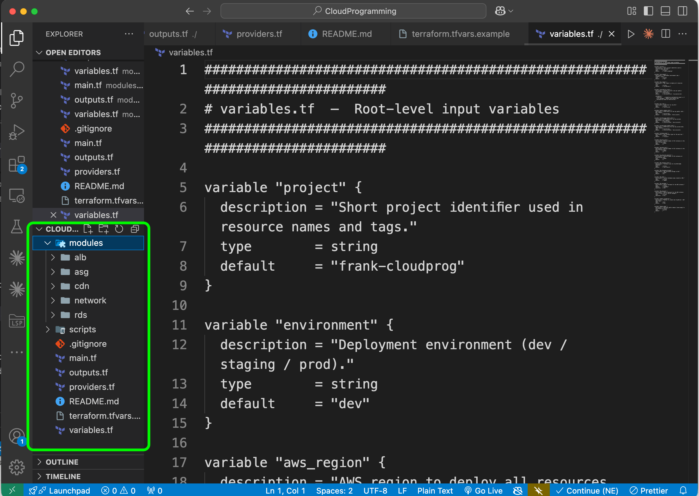

<sub><i>Figure 3 — Project structure in Visual Studio Code. Source: Own representation.</i></sub>
</div>

### 2. Push to your GitHub

```bash
git init
git add .
git commit -m "Phase 2: initial Terraform"
git branch -M main
git remote add origin https://github.com/<your-username>/CloudProgramming.git
git push -u origin main
```

<div align="center">
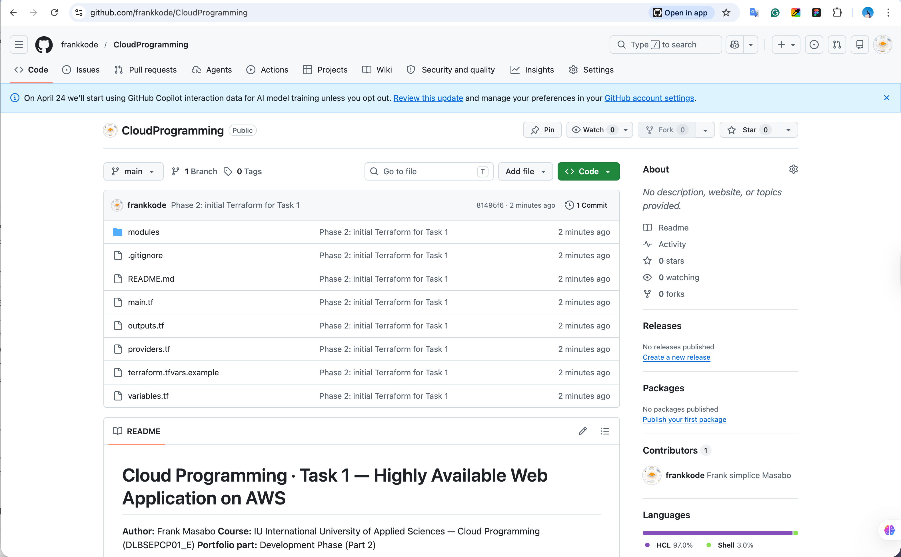

<sub><i>Figure 4 — Public GitHub repository after first push. Source: Own representation.</i></sub>
</div>

### 3. Initialise Terraform

```bash
terraform init
```

<div align="center">
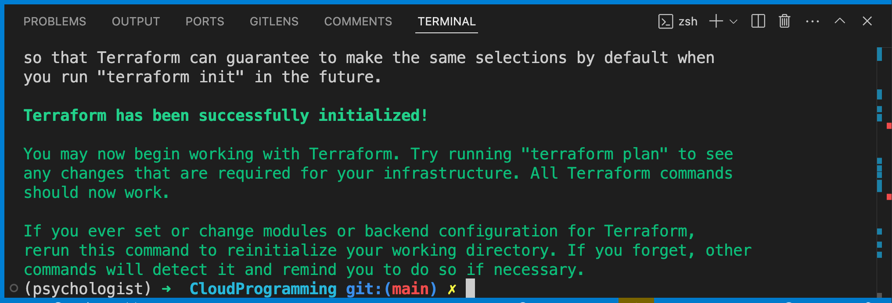

<sub><i>Figure 5 — Successful <code>terraform init</code>. Source: Own representation.</i></sub>
</div>

### 4. Review the plan

```bash
terraform plan -out=plan.tfplan
```

<div align="center">
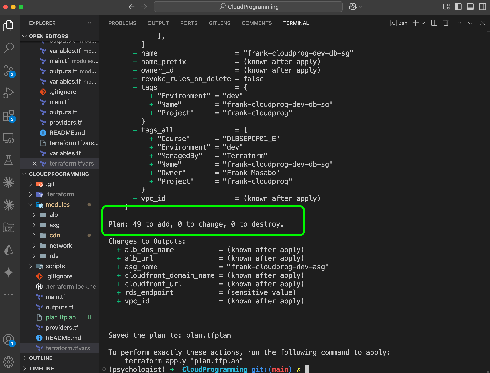

<sub><i>Figure 6 — Terraform plan: 49 resources to add. Source: Own representation.</i></sub>
</div>

### 5. Apply

```bash
terraform apply plan.tfplan
```

<div align="center">
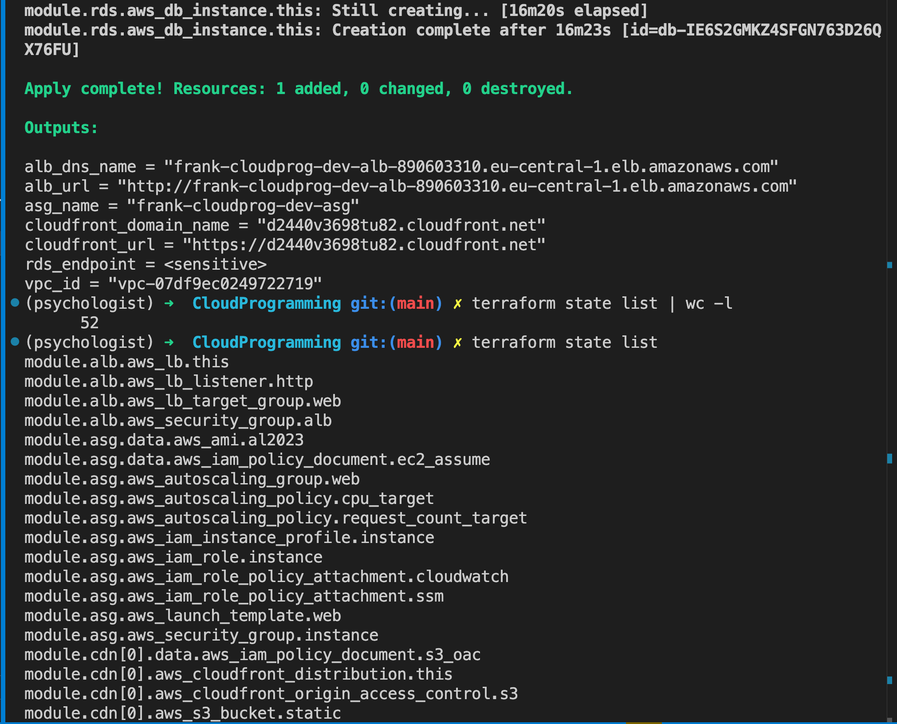

<sub><i>Figure 7 — Apply complete. 52 resources managed by Terraform. Source: Own representation.</i></sub>
</div>

---

## Module reference

| Module | Purpose | Key resources |
|---|---|---|
| **network** | Backbone of the stack | `aws_vpc`, six `aws_subnet`, `aws_internet_gateway`, two `aws_nat_gateway`, three `aws_route_table` |
| **alb** | Layer-7 load balancing | `aws_lb`, `aws_lb_target_group`, `aws_lb_listener`, `aws_security_group` |
| **asg** | Compute tier | `aws_launch_template` (IMDSv2), `aws_autoscaling_group`, two `aws_autoscaling_policy`, `aws_iam_role` + `aws_iam_instance_profile` |
| **rds** | Persistent state | `aws_db_instance` (MySQL 8.0 Multi-AZ), `aws_db_subnet_group`, `aws_kms_key`, `aws_security_group` |
| **cdn** | Edge layer | `aws_cloudfront_distribution`, `aws_wafv2_web_acl` (us-east-1), `aws_cloudfront_origin_access_control`, `aws_s3_bucket` (private) |

Each module exposes only the IDs and ARNs the next layer needs — narrow contracts keep the root composition readable.

---

## Verifying the deployment

After `terraform apply` finishes, the easiest sanity check is a tour of the AWS Console (region: **Frankfurt eu-central-1**).

### VPC subnets across both AZs

<div align="center">
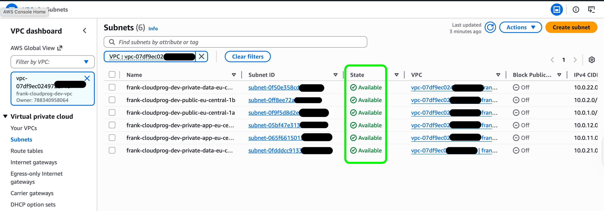

<sub><i>Figure 8 — Six subnets, three per Availability Zone. Source: Own representation.</i></sub>
</div>

### Auto Scaling Group with two healthy instances

<div align="center">
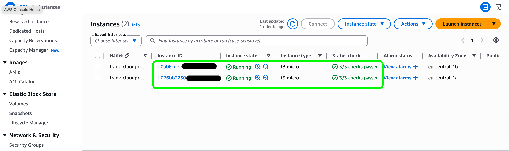

<sub><i>Figure 9 — Two EC2 instances InService, one per Availability Zone. Source: Own representation.</i></sub>
</div>

### ALB target group health

<div align="center">
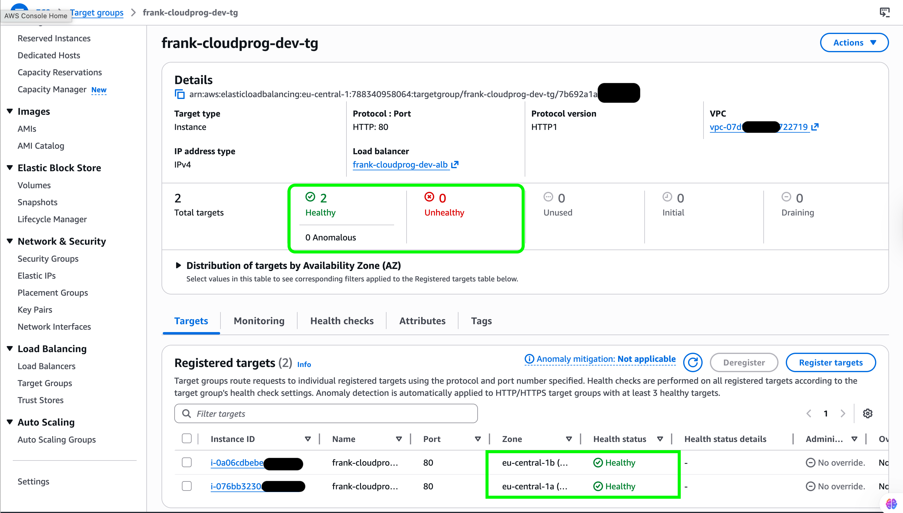

<sub><i>Figure 10 — Both targets reporting <code>healthy</code> behind the ALB. Source: Own representation.</i></sub>
</div>

### RDS Multi-AZ

<div align="center">
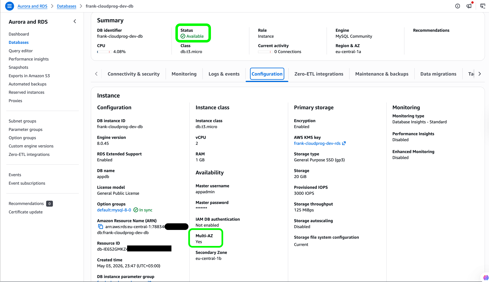

<sub><i>Figure 11 — RDS instance reporting <code>Status: Available</code> and <code>Multi-AZ: Yes</code>. Source: Own representation.</i></sub>
</div>

---

## Live application

The web tier returns a small page that prints the Availability Zone of the EC2 instance that served the request. Hard-reloading the page repeatedly demonstrates that the ALB distributes traffic across both zones.

<table>
  <tr>
    <th>First request — eu-central-1a</th>
    <th>After hard reload — eu-central-1b</th>
  </tr>
  <tr>
    <td>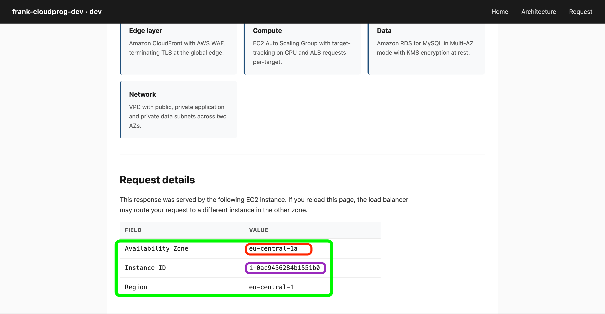</td>
    <td>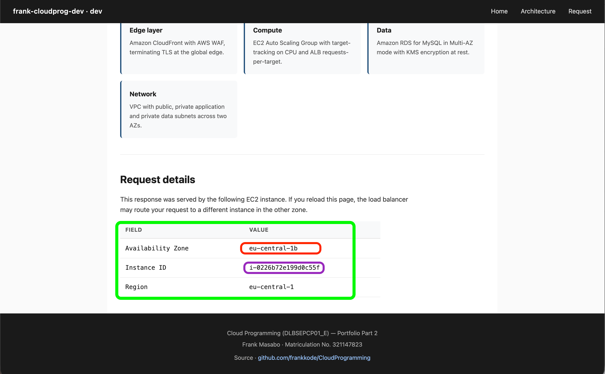</td>
  </tr>
  <tr>
    <td align="center"><sub><i>Figure 12 — Page served from eu-central-1a. Source: Own representation.</i></sub></td>
    <td align="center"><sub><i>Figure 13 — Page served from eu-central-1b. Source: Own representation.</i></sub></td>
  </tr>
</table>

A terminal-only proof of cross-AZ load balancing:

```bash
for i in {1..20}; do
  curl -s "$ALB_URL" | grep -oE "eu-central-1[ab]"
done
```

You will see a mix of `eu-central-1a` and `eu-central-1b` lines.

---

## Tearing it down

This stack costs roughly **€4 per day** if left running (NAT Gateways and RDS dominate the bill). When you are done capturing screenshots, destroy everything with one command:

```bash
make destroy
```

Under the hood this does two things:

1. Disables RDS deletion protection (`aws rds modify-db-instance ... --no-deletion-protection`)
2. Runs `terraform destroy -auto-approve`

If you prefer to run it manually, the equivalent is:

```bash
aws rds modify-db-instance \
  --db-instance-identifier frank-cloudprog-dev-db \
  --no-deletion-protection --apply-immediately \
  --region eu-central-1

terraform destroy -auto-approve
```

> The static-assets S3 bucket has `force_destroy = true`, so destroy never blocks on remaining objects.

After destroy, double-check NAT Gateways and RDS are gone:

```bash
aws ec2 describe-nat-gateways --region eu-central-1 \
  --filter "Name=state,Values=available" \
  --query 'NatGateways[*].NatGatewayId'

aws rds describe-db-instances --region eu-central-1 \
  --query 'DBInstances[*].DBInstanceIdentifier'
```

Both should return an empty array.

---

## Troubleshooting

| Symptom | Likely cause | Fix |
|---|---|---|
| `Error: configuring Terraform AWS Provider: no valid credential sources` | `aws configure` not run, or wrong profile | Re-run `aws configure`, verify with `aws sts get-caller-identity` |
| `Error: creating Auto Scaling Policy ... Invalid resource label` | `ALBRequestCountPerTarget` resource label malformed | Pass `alb_arn_suffix` and `target_group_arn_suffix` from the alb module to the asg module (see `main.tf`) |
| `Error: creating RDS DB Instance ... Performance Insights not supported` | Enabled on `db.t3.micro` (only `db.t3.medium`+ supports it) | Set `performance_insights_enabled = false` in `modules/rds/main.tf` |
| `Error: creating RDS DB Instance ... A MonitoringRoleARN value is required` | Enhanced monitoring without a role | Set `monitoring_interval = 0` in `modules/rds/main.tf` |
| Browser shows the page but the AZ and Instance ID are empty | User-data uses IMDSv1; launch template enforces IMDSv2 | Use a session token in user-data — see `modules/asg/user_data.sh.tftpl` |
| `terraform destroy` fails on RDS | Deletion protection still on | Disable it via AWS CLI (see [Tearing it down](#tearing-it-down)) |

---

## Author and course

| | |
|---|---|
| **Author** | Frank Masabo |
| **Matriculation** | 321147823 |
| **Course** | Cloud Programming (DLBSEPCP01_E) |
| **Programme** | B.Sc. Software Development |
| **Institution** | IU International University of Applied Sciences |
| **Portfolio phase** | 2 — Development |
| **Submission** | April 2026 |

### References

- HashiCorp (2024). *Terraform CLI Documentation.* <https://developer.hashicorp.com/terraform/cli>
- HashiCorp (2024). *Terraform AWS provider — official registry.* <https://registry.terraform.io/providers/hashicorp/aws/latest/docs>
- AWS (2024). *AWS Well-Architected Framework.* <https://aws.amazon.com/architecture/well-architected/>
- AWS (2024). *VPC security best practices.* <https://docs.aws.amazon.com/vpc/latest/userguide/vpc-security-best-practices.html>
- AWS (2024). *Restricting access to an Amazon S3 origin (OAC).* <https://docs.aws.amazon.com/AmazonCloudFront/latest/DeveloperGuide/private-content-restricting-access-to-s3.html>
- AWS (2024). *AWS WAF — Managed rule groups.* <https://docs.aws.amazon.com/waf/latest/developerguide/aws-managed-rule-groups.html>
- AWS (2024). *Amazon RDS Multi-AZ deployments.* <https://docs.aws.amazon.com/AmazonRDS/latest/UserGuide/Concepts.MultiAZ.html>
